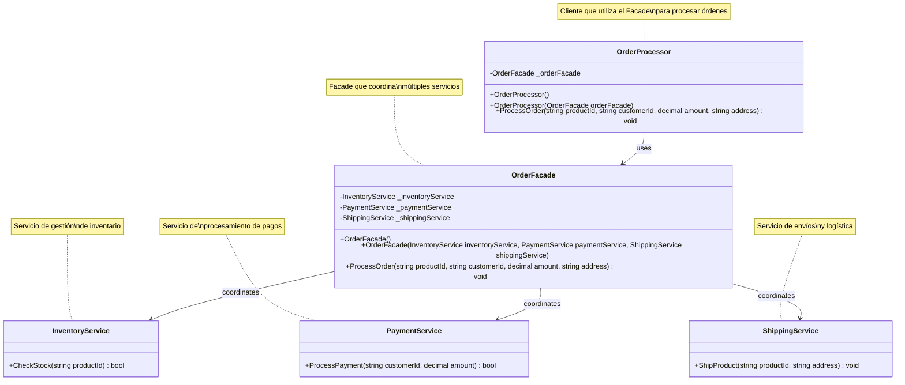

```mermaid
classDiagram
    class OrderProcessor {
        -OrderFacade _orderFacade
        +OrderProcessor()
        +OrderProcessor(OrderFacade orderFacade)
        +ProcessOrder(string productId, string customerId, decimal amount, string address) void
    }

    class OrderFacade {
        -InventoryService _inventoryService
        -PaymentService _paymentService
        -ShippingService _shippingService
        +OrderFacade()
        +OrderFacade(InventoryService inventoryService, PaymentService paymentService, ShippingService shippingService)
        +ProcessOrder(string productId, string customerId, decimal amount, string address) void
    }

    class InventoryService {
        +CheckStock(string productId) bool
    }

    class PaymentService {
        +ProcessPayment(string customerId, decimal amount) bool
    }

    class ShippingService {
        +ShipProduct(string productId, string address) void
    }

    OrderProcessor --> OrderFacade : uses
    OrderFacade --> InventoryService : coordinates
    OrderFacade --> PaymentService : coordinates
    OrderFacade --> ShippingService : coordinates

    note for OrderProcessor "Cliente que utiliza el Facade\npara procesar órdenes"
    note for OrderFacade "Facade que coordina\nmúltiples servicios"
    note for InventoryService "Servicio de gestión\nde inventario"
    note for PaymentService "Servicio de\nprocesamiento de pagos"
    note for ShippingService "Servicio de envíos\ny logística"
```