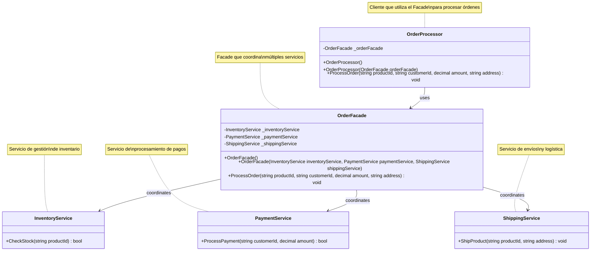
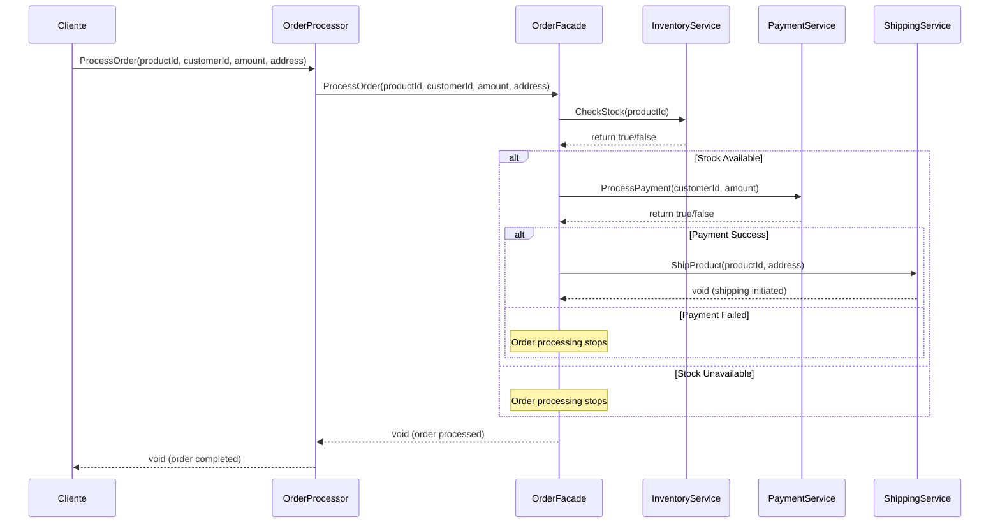

# Diseño del Sistema - Patrón Facade

## Diagrama de Clases



## Diagrama de Secuencia - Procesamiento de Orden



## Introducción

Este documento describe la implementación del **Patrón Facade** en la aplicación OrderApp, que simplifica el procesamiento de órdenes coordinando múltiples subsistemas.

## Patrón Facade

### Propósito
Proporcionar una interfaz unificada para un conjunto de interfaces en un subsistema. El patrón Facade define una interfaz de nivel superior que hace que el subsistema sea más fácil de usar.

### Problema Resuelto
Antes de aplicar el patrón Facade, el cliente (`OrderProcessor`) tenía que interactuar directamente con múltiples servicios:

```csharp
// ANTES - Sin patrón Facade
public class OrderProcessor
{
    public void ProcessOrder(string productId, string customerId, decimal amount, string address)
    {
        var inventory = new InventoryService();
        var payment = new PaymentService();
        var shipping = new ShippingService();

        if (inventory.CheckStock(productId) && payment.ProcessPayment(customerId, amount))
        {
            shipping.ShipProduct(productId, address);
        }
    }
}
```

### Solución con Patrón Facade

```csharp
// DESPUÉS - Con patrón Facade
public class OrderFacade
{
    private readonly InventoryService _inventoryService;
    private readonly PaymentService _paymentService;
    private readonly ShippingService _shippingService;

    public OrderFacade()
    {
        _inventoryService = new InventoryService();
        _paymentService = new PaymentService();
        _shippingService = new ShippingService();
    }

    public void ProcessOrder(string productId, string customerId, decimal amount, string address)
    {
        if (_inventoryService.CheckStock(productId) && 
            _paymentService.ProcessPayment(customerId, amount))
        {
            _shippingService.ShipProduct(productId, address);
        }
    }
}

// Cliente refactorizado
public class OrderProcessor
{
    private readonly OrderFacade _orderFacade;

    public OrderProcessor(OrderFacade orderFacade)
    {
        _orderFacade = orderFacade;
    }

    public void ProcessOrder(string productId, string customerId, decimal amount, string address)
    {
        _orderFacade.ProcessOrder(productId, customerId, amount, address);
    }
}
```

## Arquitectura del Sistema

### Componentes

1. **OrderFacade** (Facade)
   - Coordina los servicios de inventario, pago y envío
   - Proporciona una interfaz simplificada al cliente
   - Maneja la lógica de coordinación entre servicios

2. **InventoryService** (Subsistema)
   - Responsable de verificar el stock de productos
   - Método principal: `CheckStock(string productId)`

3. **PaymentService** (Subsistema)
   - Procesa los pagos de los clientes
   - Método principal: `ProcessPayment(string customerId, decimal amount)`

4. **ShippingService** (Subsistema)
   - Gestiona el envío de productos
   - Método principal: `ShipProduct(string productId, string address)`

5. **OrderProcessor** (Cliente)
   - Utiliza el OrderFacade para procesar órdenes
   - Simplifica su código delegando la complejidad al Facade

## Beneficios Obtenidos

### 1. Simplificación del Cliente
- El `OrderProcessor` ya no necesita conocer los detalles de múltiples servicios
- Reduce el acoplamiento entre el cliente y los subsistemas
- Facilita el mantenimiento del código

### 2. Encapsulación de la Complejidad
- La lógica de coordinación se centraliza en el `OrderFacade`
- Los cambios en los subsistemas no afectan directamente al cliente
- Mejor separación de responsabilidades

### 3. Flexibilidad y Testabilidad
- Permite inyección de dependencias para testing
- Facilita la creación de mocks para pruebas unitarias
- Mejora la modularidad del sistema

### 4. Mantenibilidad
- Cambios en la lógica de procesamiento se centralizan en el Facade
- Fácil adición de nuevos servicios sin modificar el cliente
- Código más limpio y legible

## Casos de Uso

### Caso de Uso 1: Procesamiento de Orden Exitoso
1. Cliente llama a `OrderProcessor.ProcessOrder()`
2. OrderProcessor delega a `OrderFacade.ProcessOrder()`
3. OrderFacade verifica stock con `InventoryService`
4. OrderFacade procesa pago con `PaymentService`
5. Si ambos son exitosos, OrderFacade inicia envío con `ShippingService`

### Caso de Uso 2: Fallo en Verificación de Stock
1. Cliente llama a `OrderProcessor.ProcessOrder()`
2. OrderFacade verifica stock con `InventoryService`
3. Si no hay stock, el proceso termina sin procesar pago ni envío

### Caso de Uso 3: Fallo en Procesamiento de Pago
1. Cliente llama a `OrderProcessor.ProcessOrder()`
2. OrderFacade verifica stock (exitoso)
3. OrderFacade intenta procesar pago (falla)
4. El proceso termina sin iniciar envío

## Patrones Relacionados

### Adapter Pattern
- Mientras Adapter adapta una interfaz existente, Facade simplifica múltiples interfaces

### Mediator Pattern
- Ambos desacoplan objetos, pero Mediator se enfoca en la comunicación bidireccional

### Abstract Factory Pattern
- Puede combinarse con Facade para crear familias de objetos relacionados

## Consideraciones de Implementación

### Ventajas
- ✅ Simplifica la interfaz de subsistemas complejos
- ✅ Promueve el bajo acoplamiento
- ✅ Facilita el testing y mantenimiento
- ✅ Mejora la legibilidad del código

### Desventajas
- ❌ Puede convertirse en un "god object" si no se controla su crecimiento
- ❌ Agrega una capa adicional de abstracción
- ❌ Puede limitar el acceso a funcionalidades específicas de los subsistemas

### Buenas Prácticas
- Mantener el Facade simple y enfocado
- Permitir acceso directo a subsistemas cuando sea necesario
- Usar inyección de dependencias para mejorar testabilidad
- Documentar claramente las responsabilidades del Facade

## Métricas de Calidad

### Cobertura de Código
- Las pruebas unitarias cubren todos los escenarios del Facade
- Se incluyen pruebas para constructores con y sin dependencias
- Verificación de la coordinación correcta entre servicios

### Mantenibilidad
- Separación clara de responsabilidades
- Código autodocumentado con XML comments
- Seguimiento de principios SOLID

## Conclusión

La implementación del patrón Facade en OrderApp logra exitosamente:

1. **Simplificación**: Reduce la complejidad del cliente
2. **Desacoplamiento**: Minimiza dependencias directas entre cliente y subsistemas
3. **Mantenibilidad**: Centraliza la lógica de coordinación
4. **Testabilidad**: Facilita la creación de pruebas unitarias

El patrón Facade demuestra ser una excelente solución para coordinar múltiples servicios manteniendo un código limpio y mantenible.